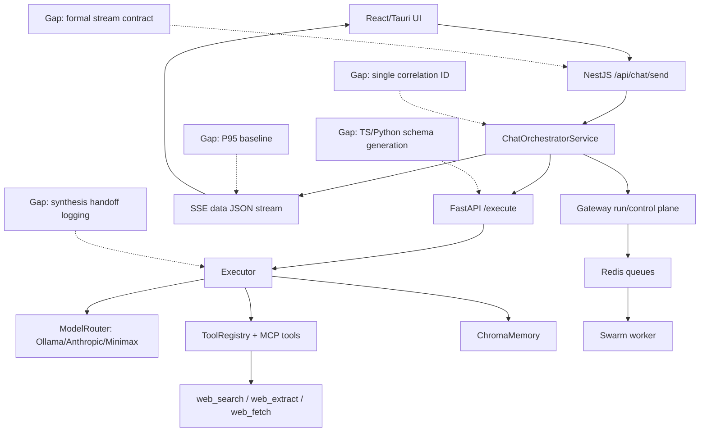

# RawClaw 50-Question Audit Answers

Generated: 2026-05-09

Scope: answers are based on the current local RawClaw codebase. Where I could confirm behavior directly from code, I mark it **Confirmed**. Where the code suggests a likely answer but a live-stack run would be needed, I mark it **Likely**. Where evidence was missing, I mark it **Gap**.

## Executive Summary

RawClaw is already more observable than the original audit implies: the chat stream emits structured JSON events for `content`, `tool_call`, `tool_result`, `provenance`, `metadata`, `error`, and `done`; NestJS has a stream inactivity timeout and heartbeats; FastAPI returns terminal `done` after agent errors; Chroma memory degrades by skipping storage/retrieval rather than hard-failing in common paths; and the sequential-thinking cap has now been lifted from hardcoded `3` to env-configured default `10`.

The biggest remaining gaps are contract formalization and replayability: there is no OpenAPI/AsyncAPI contract, SSE uses generic `data:` JSON rather than named `event:` frames, Python and TypeScript contracts are mirrored manually, there is no single canonical correlation ID visible across every layer, and there is no dedicated synthesis-prompt assembly log that records evidence count and assembled prompt length at the final handoff.

## Confirmed Code Anchors

- Chat endpoint: `apps/api/src/chat.controller.ts`
- NestJS stream bridge: `apps/api/src/chat-orchestrator.service.ts`
- Frontend stream consumer: `apps/web/src/pages/Chat.tsx`
- Agent execute endpoint: `apps/agent/src/main.py`
- Agent executor: `apps/agent/src/executor.py`
- Python chat contract mirror: `apps/agent/src/contracts/chat.py`
- TypeScript shared chat contract: `packages/shared/src/contracts/chat.ts`
- Memory backend: `apps/agent/src/memory/chroma_memory.py`
- Model routing: `apps/agent/src/models/router.py`
- Dev startup: `scripts/dev-start.mjs`
- Sequential thinking tool: `apps/agent/src/tools/builtin/sequential_thinking.py`

---

## API Designer Answers

### Q1. Is `/api/chat/send` formally documented?

**Answer: Gap.** The endpoint is implemented in `ChatController.send()` and expects a JSON `ChatRequest` body. The frontend sends `Content-Type: application/json` and bearer auth. The CLI sends `Accept: text/event-stream`. But I did not find an OpenAPI route description or a dedicated contract doc that formally states headers, body, auth, and stream framing.

**Fix:** Add `docs/api/chat-send.md` plus generated OpenAPI decorators or a contract test that asserts required headers and event schema.

### Q2. What is the error envelope contract?

**Answer: Confirmed partial.** Agent failures are emitted as JSON stream events like:

```json
{"type":"error","error":"agent_error","message":"...","provenance_trace":{...}}
```

NestJS also emits stream errors such as `agent_unavailable`, `stream_timeout`, `stream_interrupted`, and `stream_error`. If headers are not sent, the controller can return HTTP 500 JSON with `{ error, message, retryable }`.

**Gap:** It is not typed as `event: error`; it is generic `data:` JSON with `type: "error"`.

### Q3. Is there OpenAPI and AsyncAPI?

**Answer: Gap.** I found no `@nestjs/swagger`, `DocumentBuilder`, OpenAPI generation, or AsyncAPI spec in the API package. The contracts exist in TypeScript interfaces and Python Pydantic models, not in published protocol specs.

### Q4. Does `/api/chat/send` expose tool traces?

**Answer: Confirmed yes.** The stream forwards `tool_call` and `tool_result` events to the client. NestJS accumulates `toolCalls` and `toolResults`, logs stream completion counts, persists metadata, and the React client stores recent tool calls and results for rendering.

**Caveat:** UI rendering may truncate or summarize the visible trace, but the stream carries it.

### Q5. What happens on partial stream failure?

**Answer: Confirmed partial.** NestJS has an inactivity timeout of 75 seconds, heartbeat events every 10 seconds, and finalizes with `stream_timeout` if the agent goes silent. Agent stream errors finalize with `stream_interrupted`. If the agent stream ends without a `done`, the orchestrator finalizes with `done`, which avoids hanging but can hide abnormal termination unless paired with other diagnostics.

### Q6. Is `/api/chat/send` versioned?

**Answer: Gap.** I found no versioned route like `/api/v1/chat/send`, no stream schema version on every event, and no migration layer. Some nested structures have schema versions, but the SSE stream itself is not versioned as a protocol.

### Q7. Why does scripted replay return `agent_error 500` while UI succeeds?

**Answer: Likely causes, not fully confirmed.** The API is guarded by `JwtAuthGuard`; scripted replay must include a valid bearer token. The UI uses `/api/chat/send` with JSON body and authorization. Some scripts include `Accept: text/event-stream`; the UI path in `Chat.tsx` does not visibly send `Accept`, but still succeeds because the server unconditionally sets SSE headers after accepting the request.

Most likely causes are auth mismatch, request body mismatch, or hitting the controller-level 500 before headers are sent. Missing `Accept` is less likely to be the sole cause.

**Fix:** Log request validation/auth failures with session ID and body-shape summary before the orchestrator call.

---

## Architecture Designer Answers

### Q8. Does Python have typed equivalents of `@rawclaw/shared`?

**Answer: Confirmed partial.** Python has Pydantic mirrors in `apps/agent/src/contracts/*.py`, including `ChatRequest`, `ChatMessage`, and tool contracts. The TypeScript contracts live in `packages/shared/src/contracts`. They are manually mirrored, not generated from a single schema.

**Risk:** Type drift is possible.

### Q9. Who owns the NestJS to FastAPI boundary?

**Answer: Confirmed.** NestJS owns orchestration and calls FastAPI over HTTP. It posts to `${agentUrl}/execute` with `responseType: "stream"` and bridges agent newline-delimited JSON into browser SSE.

### Q10. Is ChromaDB accessed by both FastAPI and swarm-worker?

**Answer: Confirmed mixed ownership.** FastAPI uses Chroma directly via `ChromaMemory`. MCP discovery also indexes tools into Chroma. The swarm worker advertises `chromaUrl` and runs agent execution bridge jobs, but from the inspected code it primarily talks Redis and API. Memory ownership is not cleanly centralized; the API also has memory services.

**Risk:** Multiple writers are possible through API, agent, and discovery paths unless operationally constrained.

### Q11. Ollama unavailable fallback?

**Answer: Confirmed partial.** `ModelRouter` supports providers `ollama`, `anthropic`, and `minimax`. If no explicit model is requested, it builds an Ollama fallback chain. If the explicit selected model fails, it generally stays pinned and does not silently substitute arbitrary models. Cloud-style model IDs can route to Anthropic/Minimax if configured, otherwise provider-unconfigured paths are skipped.

**Bottom line:** Some local failures degrade through fallback order; explicit local model failures can surface as errors.

### Q12. Does Tauri talk to NestJS or FastAPI?

**Answer: Likely NestJS.** The web frontend talks to `/api/...`, and desktop appears to bundle/use the web frontend path rather than directly calling FastAPI. I did not confirm a separate Tauri direct FastAPI client.

### Q13. Does Turborepo enforce build order?

**Answer: Confirmed partial.** Root `turbo.json` has `build.dependsOn: ["^build"]`. `@rawclaw/api` build explicitly runs shared build first. Tests depend on build. This is decent for build order.

**Gap:** Runtime dev mode still uses ts-node/transpile paths and can drift from generated `dist` if scripts bypass turbo build.

### Q14. Is Docker Compose the only deployment target?

**Answer: Likely local-first.** The env and scripts assume localhost Redis, Chroma, Ollama, FastAPI, and NestJS. Docker Compose exists. I did not find a cloud deployment manifest. Cloud model providers exist, but infra is local-first.

---

## Chaos Engineer Answers

### Q15. Ollama crash mid-stream?

**Answer: Confirmed likely behavior.** If the agent emits an error, NestJS finalizes with an error event. If the agent goes silent, NestJS times out after 75 seconds and emits `stream_timeout`. If the underlying stream emits error, it finalizes `stream_interrupted`.

### Q16. ChromaDB unavailable?

**Answer: Confirmed graceful in common paths.** `ChromaMemory` init logs a warning and sets `collection = None`. `add_message` skips storage if unavailable. Several memory calls catch/log failures. The agent can answer without memory.

**Risk:** The UI may not make this degradation obvious unless memory events are surfaced.

### Q17. Redis down?

**Answer: Mixed.** `scripts/dev-start.mjs` preflight fails startup unless `RAWCLAW_ALLOW_DEGRADED_STARTUP=true`. Swarm worker waits for Redis/API and does not become online until dependencies are reachable. Foreground chat can still work if Redis-dependent gateway features are not required, but the full Phase 3 worker path depends on Redis.

### Q18. DuckDuckGo 429?

**Answer: Confirmed fallback logic exists.** `SmartWebSearchTool` classifies rate limits, network failures, timeouts, and transport failures. It marks providers unavailable for the request and tries other discovered search providers/query variants within a total budget.

**Gap:** If no alternate provider works, it returns structured provider failure; the answer still depends on the research path having direct target URLs or useful fallback extraction.

### Q19. HTTP 200 with minimal body?

**Answer: Confirmed mostly handled.** Evidence pipeline treats zero-word bodies as unusable, clean extracts require word count >= 50 unless structured records are strong, and web extract has `extract_garbage` / `tier=failed` paths for empty SPA shells. There are tests for empty body and minimal content.

**Caveat:** A short but structured result can be accepted, intentionally.

### Q20. Swarm worker crash?

**Answer: Confirmed heartbeat exists.** Swarm worker registers with API and heartbeats with status/lease info. The API has gateway worker monitor services. I did not verify end-to-end worker-death recovery behavior in a live run.

### Q21. Pathological thinking loop after raising cap to 10?

**Answer: Confirmed bounded by executor caps, not LangGraph.** No `recursion_limit` was found. The relevant caps are `MAX_SEQUENTIAL_THINKING_TURNS`, `MAX_AGENT_TURNS`, and `MAX_EXECUTION_SECONDS = 120`. The thinking cap is now env-driven default 10.

---

## CLI Developer Answers

### Q22. Direct `executor.py` CLI?

**Answer: Gap.** I found scripts for API-based chat (`scripts/chat-cli.mjs`) and diagnostics (`apps/agent/diagnose_agent.py`), but not a polished `python -m ... "query"` executor CLI that bypasses NestJS and Docker cleanly.

### Q23. Single `turbo dev` command?

**Answer: Confirmed root `npm run dev`.** Root `dev` runs `node scripts/dev-start.mjs`, which preflights Redis and Chroma and then starts services. It does not start Redis/Chroma/Ollama itself; it expects them available or degraded startup enabled.

### Q24. CLI for ChromaDB inspection?

**Answer: Gap/partial.** There are memory endpoints and debug scripts, but no obvious first-class CLI to list collections, query by agent/session, or clear stale embeddings.

### Q25. ToolRegistry management commands?

**Answer: Partial.** FastAPI exposes `/api/tools`, `/api/tools/info`, `/api/tools/health`, and web fetch diagnostics. There is no dedicated CLI for hot-reload or isolated tool execution beyond tests/scripts.

### Q26. Logged query replay command?

**Answer: Partial.** There are replay-ish test scripts like `web-research-progression-test.py`, `combined-chat-session-test.py`, and diagnostic JSON outputs. I did not find a single command that consumes a saved `research_extract_diagnostic` and replays the exact extraction/synthesis chain deterministically.

---

## Debugging Wizard Answers

### Q27. `contentLength=440` vs `word_count=436`

**Answer: Likely suspicious but not proven.** `contentLength` in NestJS logs is final assistant response character count, while `word_count` likely describes extracted evidence. They are not the same metric. However, the mismatch is still a good signal to log synthesis input length and evidence item count.

### Q28. HTML entity decoding?

**Answer: Likely partial.** Web extraction has HTML/tag cleanup and raw HTML recovery paths, but I did not confirm comprehensive entity decoding for every structured field like `what_changed`. Add explicit `html.unescape` coverage for structured text fields and tests for `&amp;`, `&lt;`, `&quot;`.

### Q29. LOG_LEVEL normalization everywhere?

**Answer: Partial.** Some entry points normalize with `str(os.getenv("LOG_LEVEL", "INFO")).upper()`. I did not verify every mid-module read. Best fix is central config-only access.

### Q30. Thinking cap: are thoughts discarded?

**Answer: Confirmed partial.** Sequential thinking tool calls are intercepted and emitted as `thinking` events. The actual tool result is still added to messages as a summarized tool result, so the model can see prior thinking-tool acknowledgements, but not necessarily a full accumulated private chain. The UI receives thinking text; final answer continues with accumulated conversation/tool messages.

### Q31. Correlation ID across frontend to tools?

**Answer: Partial.** There are session IDs, gateway run IDs, provenance trace run IDs, binding IDs, and tool provenance. But I did not find one canonical correlation ID that is injected into every log line across frontend, NestJS, FastAPI, tool calls, and worker jobs.

### Q32. Seven failing tests from phase 6.6?

**Answer: Not confirmed in this pass.** I did not rerun the old phase 6.6 suite. Current targeted runs passed for thinking and research. The old seven failures need a dedicated triage table with test name, failure type, root cause, and owner.

### Q33. LangGraph recursion limit?

**Answer: No evidence in current app code.** `rg recursion_limit` returned no app/env matches. If a LangGraph path exists, it is not using that literal setting in the inspected code.

### Q34. Evidence assembly logging?

**Answer: Partial.** There is `research_extract_diagnostic` logging around extraction quality and content length. I did not find a dedicated final synthesis prompt log like `[SYNTHESIS_PROMPT] evidence_count=... prompt_len=...`.

**Fix:** Add it at the point where `FinalWriterStage.run()` invokes `_render_grounded_web_answer`, or immediately before any LLM synthesis path that uses assembled evidence.

---

## Prompt Engineer Answers

### Q35. Is system prompt versioned?

**Answer: Confirmed yes, partially.** Prompt blocks/packs live under `prompts/` and `PromptCatalogService` computes `promptVersionHash`. This is better than a purely inline prompt. However, `executor.py` still contains important inline system instructions such as strict synthesis rules and sequential thinking guidance.

### Q36. Does synthesis prompt strip HTML?

**Answer: Partial.** The extraction layer is expected to clean evidence. Strict synthesis rules tell the model to answer only from tool results, but I did not find a dedicated prompt rule saying "strip/ignore HTML markup and entities in evidence snippets." This should be added defensively.

### Q37. Election-result quality gate few-shots?

**Answer: Gap.** The election route/classification was recently added as code logic; I did not find few-shot examples for election-result `extract_clean` vs `extract_garbage`.

### Q38. Cloud vs local prompt path?

**Answer: Mostly same prompt path.** NestJS composes the prompt before model routing, and the agent receives messages/tools independent of provider. Model providers may differ in tool support and formatting, but the upstream prompt path is shared.

### Q39. Grounding instruction?

**Answer: Confirmed yes in executor strict rules.** `_strict_synthesis_rules()` explicitly says answer only from tool results and avoid unsupported claims. The research writer also renders grounded answers from evidence/assessment inputs. The prompt catalog also emphasizes uncertainty and workflow guidance.

### Q40. Thinking tool context accumulation?

**Answer: Partial.** The tool itself is stateless and only acknowledges the thought. Accumulation happens through the executor adding tool-result messages and the model's ongoing chat context, not through MCP server state.

### Q41. Planner source diversity prompt?

**Answer: Mostly code-level, not prompt-level.** Research planning uses code fields like `source_preferences`, `domain_bias`, ranking, and pre-evidence filters. I did not find a planner prompt specifically instructing diverse domains before planning.

---

## Test Master Answers

### Q42. Executor coverage percentage?

**Answer: Not measured.** There are many tests touching executor paths, research stages, memory boundaries, page read hardening, thinking, and budget behavior. But I did not run coverage, so percentage is unknown.

**Fix:** Add `pytest --cov=src.executor --cov=src.research` to the regression pack.

### Q43. Are research tests live Ollama or mocked?

**Answer: Mostly mocked/unit-level.** `test_research_stages.py` directly exercises stages and helper methods; smoke tests mock model router/tool execution. Live tests exist separately, but core regression tests are not dependent on live Ollama.

### Q44. Full E2E POST to `/api/chat/send`?

**Answer: Partial.** Several scripts exercise POST `/chat/send` over SSE, and web tests exercise client parsing. I did not confirm a single CI-grade E2E test that boots NestJS + FastAPI + tools + frontend rendering together.

### Q45. Seven failing tests triaged?

**Answer: Gap.** No current triage artifact was found in this pass that lists the seven phase 6.6 failures with root causes.

### Q46. P95 latency performance test?

**Answer: Gap/partial.** There are stage timing fields and logs for first event latency and tool durations. I did not find a formal P95 performance benchmark for research path.

---

## WebSocket/SSE Engineer Answers

### Q47. Typed `event: error`?

**Answer: No.** Errors are structured JSON payloads inside generic SSE `data:` frames:

```text
data: {"type":"error","error":"stream_timeout","message":"..."}
```

There is no named `event: error` line.

### Q48. Frontend reconnect/deduplicate?

**Answer: Partial.** The frontend detects incomplete streams and can call recovery/regenerate flows. I did not see automatic EventSource-style reconnect with token-level dedupe. It uses `fetch()` streaming, so reconnection must be manually implemented.

### Q49. Backpressure?

**Answer: Basic Node streaming only.** NestJS writes to Express response with `res.write(...)`. I did not find explicit checking of the boolean return value or `drain` handling. For normal local usage this is usually fine; for slow clients it is a gap.

### Q50. Typed SSE events or generic JSON?

**Answer: Generic JSON.** All events are sent as `data: {json}\n\n`; clients inspect `data.type`. There are distinct logical types, but not distinct SSE event names.

---

## Nine Problem Clusters

### Gap 1: Protocol contract is implicit

The chat stream behavior is real and structured, but it is not formally described as OpenAPI/AsyncAPI. New clients must reverse-engineer `data.type` values.

### Gap 2: Synthesis assembly observability is thin

There are extraction diagnostics and final response logs, but not a direct synthesis handoff log with evidence count, assembled prompt length, selected sources, and final writer mode.

### Gap 3: Correlation identity is fragmented

Session ID, gateway run ID, provenance run ID, and binding ID all exist. A single request correlation ID should be generated at the API edge and carried everywhere.

### Gap 4: Cross-language schema drift risk

TypeScript shared contracts and Python Pydantic contracts mirror each other manually. Generate one from the other or validate parity in CI.

### Gap 5: Chaos behavior exists but is not systematically tested

Timeouts, heartbeats, provider fallback, and memory degradation exist. They need dedicated failure-injection tests.

### Gap 6: Prompt safety is split across catalog and inline code

Prompt packs are versioned, but executor inline rules still carry important behavior. Move more of this into versioned prompt blocks or add tests around inline prompt mutations.

### Gap 7: Unknown historical test failures

The referenced seven phase 6.6 failures remain untriaged in this audit. Unknown failing tests are risk multipliers.

### Gap 8: Developer replay tooling is incomplete

There are useful scripts, but no single first-class replay tool for "take this saved diagnostic and replay extraction/synthesis exactly."

### Gap 9: Performance baseline missing

The system logs timings, but does not appear to publish P50/P95 baselines for first token, tool latency, research completion, or stream completion.

---

## Visual Map



---

## Prioritized Fix Order

### Before canary

1. Add synthesis handoff logging:
   - `evidence_count`
   - `search_status`
   - `fetch_status`
   - `fetch_quality`
   - `assembled_prompt_chars` if an LLM prompt is used
   - `render_mode` or final writer decision mode

2. Write a stream contract doc:
   - request body
   - auth
   - headers
   - every `data.type`
   - terminal event rules
   - partial failure behavior

3. Triage the seven old failures:
   - test name
   - failure class: import/setup/assertion/live dependency
   - root cause
   - fixed/skipped/quarantined decision

### During canary

4. Add request correlation ID:
   - generated by NestJS at request start
   - sent to FastAPI
   - included in provenance metadata
   - included in every important log line

5. Harden synthesis prompt and extraction cleanup:
   - explicit HTML/entity stripping rule
   - `html.unescape` for structured fields
   - regression tests for HTML entities in `what_changed`

### Post-canary

6. Generate Python and TypeScript contracts from one schema.
7. Add a replay CLI for saved research diagnostics.
8. Add chaos tests for Ollama crash, Chroma down, Redis down, 429 search, empty 200 body, and worker crash.
9. Add performance benchmarks and publish P50/P95 numbers.

---

## Recommended Immediate Patch

Add a synthesis diagnostic near `FinalWriterStage.run()`:

```python
logger.debug(
    "[SYNTHESIS_HANDOFF] query=%r category=%s decision=%s evidence_count=%s "
    "search_status=%s fetch_status=%s fetch_quality=%s source_count=%s",
    query[:160],
    plan.category,
    decision.mode,
    len(assessment.search_evidence or []),
    search_status,
    fetch_status,
    assessment.quality,
    len(assessment.candidate_urls or []),
)
```

If later an LLM-based synthesis prompt is assembled, log the assembled prompt length and evidence item count immediately before the model call. Do not log full evidence bodies by default; include a debug flag for redacted previews only.

