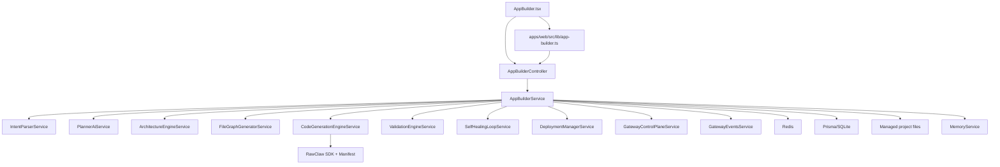
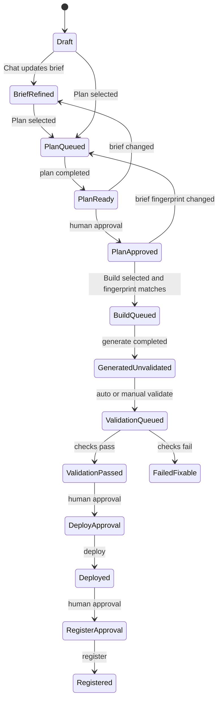

# RawClaw App Builder Architecture Review Report

Date: 2026-05-04

## Executive Summary

RawClaw App Builder is a managed app-generation and control pipeline that turns a user brief into a local React/Vite application with RawClaw SDK hooks, manifests, preview/deployment plumbing, validation artifacts, and registry/control endpoints. It has three user-facing composer lanes:

- Chat: clarify, inspect state, and refine the brief.
- Plan: create intent, spec, architecture, docs, and task artifacts for review.
- Build: generate or adapt application files, gated by an approved current Plan.

The system is intentionally deterministic in its v1 generation layer. It uses parser/spec/template/codegen services rather than unconstrained arbitrary AI code generation. AI model calls are used for builder conversation, planner review summaries, and builder implementation briefs; core artifacts are produced by structured services.

The highest-risk areas are trust and state transition clarity: users must know when a brief changes, Build must not silently make unreviewed planning decisions, generated files need transaction/version boundaries, and validation should become an automatic post-generate step.

## Scope

This report covers the App Builder architecture across:

- API services under `apps/api/src/app-builder/`
- API controllers under `apps/api/src/app-builder*.controller.ts`
- Shared contracts under `packages/shared/src/contracts/app-builder.ts`
- Web client API wrapper under `apps/web/src/lib/app-builder.ts`
- Main App Builder UI under `apps/web/src/pages/AppBuilder.tsx`
- RawClaw app SDK manifest validation under `packages/app-sdk/src/index.ts`

## Primary Goals

App Builder is trying to provide:

1. A conversational front door for creating managed RawClaw apps.
2. A structured planning phase before code generation.
3. Deterministic local app generation with RawClaw control hooks.
4. A visible workspace with files, docs, activity, terminal, preview, logs, and validation.
5. A manifest and registry contract so generated apps can be controlled by RawClaw.
6. Human approval gates between risky stages.

## High-Level Architecture



## Main Modules

### Web UI

`apps/web/src/pages/AppBuilder.tsx`

Responsibilities:

- Maintains draft/project UI state.
- Renders Chat / Plan / Build segmented composer.
- Sends `lane: discuss | plan | build`.
- Displays dashboard, active workspace, files, docs, preview, terminal, logs, validation, registry, and conversation.
- Uses detail artifacts to show architecture, file graph, validation session, and project state.

Key risk:

- The UI can present "Build" as a simple action while backend policy may convert it into Plan-first gating. The response text must make that transition explicit.

### Web API Client

`apps/web/src/lib/app-builder.ts`

Responsibilities:

- Thin typed wrapper around App Builder endpoints.
- Fetches templates, projects, conversations, briefs, project detail, preview, workspace files, docs, tasks, terminal, manifests, validation, approval, runs, and registry records.

Notable endpoints consumed:

- `GET /app-builder/templates`
- `GET /app-builder/projects`
- `GET /app-builder/conversations`
- `GET/PATCH /app-builder/brief`
- `POST /app-builder/assistant/messages`
- `GET /app-builder/projects/:id`
- `POST /app-builder/projects/:id/runs`
- `POST /app-builder/projects/:id/approval`
- `POST /app-builder/projects/:id/manifest/validate`
- `GET/POST workspace file endpoints`

### API Controller

`apps/api/src/app-builder.controller.ts`

Responsibilities:

- Exposes HTTP endpoints.
- Mostly delegates directly to `AppBuilderService`.
- Also exposes app registry/control endpoints such as command execution and event stream.

### Internal Worker Controller

`apps/api/src/app-builder.internal.controller.ts`

Responsibilities:

- Allows worker/internal execution to call `executeQueuedRun`.
- Complements the queue-based execution model.

### AppBuilderService

`apps/api/src/app-builder/app-builder.service.ts`

This is the orchestration hub. It owns:

- Schema bootstrap for App Builder tables.
- Conversation and brief storage.
- Draft/project creation.
- Lane classification and execution mapping.
- State query answering.
- Project detail aggregation.
- Artifact storage/retrieval.
- Project docs/task list/memory writes.
- Manifest generation.
- Approval gates.
- Queue/job lifecycle.
- File workspace operations.
- Terminal session support.
- Validation/deploy/register/export/rollback/control command execution.

This service is large and central. That is useful for orchestration but creates review risk: policy, persistence, UX messaging, phase execution, and control endpoints all live in one place.

## Shared Contracts

`packages/shared/src/contracts/app-builder.ts`

Important types:

- `AppBuilderProject`
- `AppBuilderRun`
- `AppBuilderBriefDraft`
- `AppBuilderConversation`
- `AppBuilderAssistantRequest`
- `AppBuilderAssistantResponse`
- `AppBuilderIntent`
- `AppSpecJson`
- `ArchitecturePlan`
- `FileGraph`
- `ValidationSession`
- `RawClawAppManifest`
- `RawClawControlCommand`
- `RawClawControlResponse`
- `AppBuilderApprovalStage`
- `AppBuilderPhase`

The core artifact chain is:

```text
Brief -> Intent -> AppSpecJson -> ArchitecturePlan -> FileGraph -> Files + Manifest -> Validation -> Deploy/Register
```

## Lane Semantics

### Chat Lane

Input:

- UI sends `lane: "discuss"`.

Current behavior:

1. Backend trims message and classifies it.
2. State queries are detected first.
3. If state query, backend answers from draft/project state.
4. Otherwise, backend may update the brief if the message appears to contain project intent.
5. Backend sends draft/project conversation to configured App Builder chat model route.
6. Response is appended to conversation.
7. No phase runs unless the text explicitly asks for a phase.

Recent trust fix:

- If Chat mutates the brief, assistant content is prefixed with: `Brief updated: I captured that as a change to the builder brief.`

Remaining risk:

- The trigger for brief mutation is still heuristic (`shouldCapturePromptInBrief`). It is visible now, but still broad.

### Plan Lane

Input:

- UI sends `lane: "plan"`.

Current behavior:

1. State query check still wins first.
2. Otherwise, `lane: plan` becomes execution intent for phase `plan`.
3. Draft/project brief is saved or merged.
4. Prompt is parsed into `AppBuilderIntent`.
5. Project is created if needed.
6. Plan phase is queued, then often executed inline by `executePhaseInline`.
7. `ensurePlanningArtifacts()` creates:
   - intent artifact
   - spec artifact
   - architecture artifact
   - docs/project bible
   - task list
   - memory snapshot
   - planner activity
   - manifest
8. Plan completion sets pending approval stage to `plan`.
9. User must approve Plan before Build can generate.

Recent trust fix:

- Plan stores `planBriefFingerprint`.
- Plan approval stores `planApprovedBriefFingerprint`.

### Build Lane

Input:

- UI sends `lane: "build"`.

Current behavior:

1. State query check still wins first.
2. Otherwise, generated apps map Build to `generate`.
3. Imported apps map Build to `adapter-generate`.
4. Build phases are now gated by the approved Plan fingerprint.
5. If there is no approved/current Plan:
   - backend runs/refeshes Plan
   - stops at Plan approval
   - does not generate files
6. If the current brief matches the approved Plan:
   - `generate` or `adapter-generate` can be queued/executed.

Recent trust fix:

- Build gate is enforced in:
  - composer flow
  - public `queueProjectPhase`
  - worker `executeQueuedRun`

Remaining risk:

- After `generate`, validation is still a separate phase rather than automatic.

## Proposed Explicit State Machine

Current implementation has implicit transitions. The review target should move toward this explicit model:



Recommended legality rules:

- Chat may update a brief, but must say so.
- Plan may run from Draft or BriefRefined.
- Build may only run from PlanApproved where approved fingerprint equals current brief fingerprint.
- Build before PlanApproved should transition to PlanQueued, not Generate.
- A changed brief after PlanApproved invalidates Build until Plan is refreshed and approved.
- Deploy/Register require validation and approval.

## Intent Parsing

`IntentParserService`

Responsibilities:

- Resolves source type/domain.
- Extracts requested features.
- Extracts explicit RawClaw actions from `expose actions:`.
- Extracts runtime events from `emit events when:`.
- Normalizes event phrases into dotted names.
- Determines default/fallback actions/events.
- Infers requested phases from prompt terms.

Known domains:

- `calculator`
- `dashboard`
- `crud`
- `ai_console`
- `generic_web`
- `imported_adapter`

Recent fixes:

- Calculator detection no longer hijacks content approval dashboards.
- RawClaw actions/events are no longer hardcoded only for approval dashboards.
- Image viewer prompts are treated as generic web with image-specific features.

Risk:

- Parser is heuristic. Deterministic, testable, but limited.
- Domain-specific feature extraction can become a hidden template-routing layer.

## Planning and Spec Creation

`PlannerAiService`

Despite its name, this service is deterministic in current code. It maps `AppBuilderIntent` to `AppSpecJson`.

Outputs:

- title
- summary
- appType
- templateId
- domain
- routes
- features
- uiSections
- dataModel
- controlActions
- runtimeEvents
- notes

Special cases:

- Calculator gets display/keypad/history.
- AI console gets prompt composer/run history/approval/result viewer.
- CRUD gets table/filters/detail/create form.
- Dashboard/generic uses default sections unless intent features drive codegen later.

Risk:

- The service name implies AI generalization, but behavior is deterministic. This should be renamed or documented.

## Architecture Plan

`ArchitectureEngineService`

Current output is fixed:

- framework: React
- buildTool: Vite
- language: TypeScript
- styling: CSS
- stateStrategy: local state
- sdkTransport: HTTP
- dependencies: React/React DOM
- previewStrategy: dist HTTP server
- validationCommands from template

Risk:

- Architecture is not deeply inferred. It is a consistent scaffold plan.

## File Graph

`FileGraphGeneratorService`

Creates a dependency-ordered file list:

Base files:

- `package.json`
- `README.md`
- `tsconfig.json`
- `vite.config.ts`
- `index.html`
- `src/styles.css`
- `src/rawclaw-sdk.ts`
- `src/main.tsx`
- `rawclaw.app.manifest.json`

Domain extras:

- Calculator: `src/components/Calculator.tsx`, `src/App.tsx`
- AI console: `src/components/PromptConsole.tsx`, `src/App.tsx`
- Dashboard: `src/components/KpiCard.tsx`, `src/App.tsx`
- Generic: `src/App.tsx`

Risk:

- File graph is deterministic and small. Good for predictability, but novel app structures are not currently represented.

## Code Generation

`CodeGenerationEngineService`

Responsibilities:

- Renders each file task.
- Generates package/config/index/main/styles/SDK/manifest/readme.
- Keeps calculator and AI console specialized components.
- Generates data-driven generic/dashboard shells from spec.
- Generates image viewer UI when spec indicates image/gallery/viewer/zoom/rotate/metadata.

Current image viewer output includes:

- upload images
- gallery
- selected image viewer
- metadata/details
- review history
- search/filter
- zoom/rotate/favorite
- approve/reject
- RawClaw event emits

Risk:

- Output is template-driven. This is reliable and testable but not "AI can build any app" generalization.
- Generated file writes are not yet transactionally snapshotted as one coherent version.

## Manifest and RawClaw Control

Manifest generation:

- `generateManifest()`
- `buildManifest()`
- `capabilitiesForSpec()`

Manifest includes:

- appId
- name
- appType/sourceType
- compatibility
- controlMode
- routes
- capabilities
- permissions
- control endpoints
- env requirements
- deployment target/location
- metadata with domain/runtime events/UI sections

Control command execution:

- `executeControlCommand(appId, command)`

Current command handling:

- Validates app registration.
- Validates command against manifest capability.
- Blocks non-status commands for observe-only apps.
- Handles calculator commands explicitly.
- Handles `app.navigate`, `records.create`, `tool.run`, `adapter.forward`.
- Publishes app events.
- Stores control state in Redis.

Risk:

- Generated custom actions like `approve_image` exist in manifest, but backend control behavior for arbitrary generated actions may only produce generic execution unless specialized handling is added.

## Validation

`ValidationEngineService`

Runs template commands through `ProcessControllerService`:

- TypeScript typecheck
- Vite build
- optional ESLint

`runValidationLoop()`:

- Generates file graph.
- Runs validation.
- Uses `SelfHealingLoopService` to regenerate failed files and rerun validation.
- Stores validation and healing artifacts.

Current issue:

- Validation is not guaranteed immediately after `generate`.
- A generated project can exist as `GeneratedUnvalidated`.

Recommendation:

- Make `generate` completion automatically queue `validate`, or change project status to `generated_unvalidated` and block preview/deploy until validation passes.

## Self-Healing

`SelfHealingLoopService`

Responsibilities:

- Accept initial validation session.
- Determine failed files.
- Regenerate failed file set.
- Rerun validation.
- Store healing attempts.

Risk:

- Because codegen is template-driven, regeneration of failed files may simply reproduce the same bug unless the generator has conditional repair logic.

## Deployment and Preview

`DeploymentManagerService`

Responsibilities:

- Finds available preview port.
- Starts local preview runtime.
- Tracks preview process.

App Builder service also:

- Builds preview state.
- Exposes preview endpoint.
- Stores preview session artifact.
- Updates project metadata.

Risk:

- Preview should be gated behind validation if trust is the priority.

## Approval Gates

Approval stages:

- plan
- build
- validate
- deploy
- register

Core functions:

- `pendingApprovalStage()`
- `approvalStageForPhase()`
- `phaseAllowedDuringPendingApproval()`
- `approveProject()`
- `nextStatusAfterApproval()`

Recent trust improvement:

- Build now requires an approved Plan fingerprint matching the current brief.

Remaining question:

- Whether Build approval should also carry a generated-files fingerprint before validation/deploy.

## Storage Model

### Prisma/SQLite

Stores:

- projects
- runs
- manifests
- registry records
- imported adapters
- validations
- artifacts table via raw SQL

### Redis

Stores:

- draft/project conversations
- brief drafts
- terminal sessions
- app control state
- app event backlog

### Filesystem

Managed app files live under:

```text
data/app-builder/projects/<slug>/current
```

Docs include:

- `docs/PROJECT_BRIEF.md`
- `docs/PLAN.md`
- `docs/TASKS.md`
- `docs/DECISIONS.md`
- `docs/AGENT_MEMORY.md`
- `docs/STATUS.md`

Risk:

- Generation writes directly to the managed path. There is no atomic staging directory promotion yet.

## Activity and Conversation Updates

Activity events are stored as artifacts of kind `activity`.

Conversation updates are appended for:

- phase start
- phase completion
- phase failure
- state query responses
- draft chat replies

Risk:

- Since activity is artifact-backed, it can become noisy and may need indexing/pruning rules.

## Queue and Worker Execution

`queueProjectPhase()`:

- checks pending approval stage
- now checks Build Plan gate
- creates gateway run
- creates app builder run
- enqueues builder job
- updates project/run status
- records activity

`executeQueuedRun()`:

- resolves job/project/run
- sets gateway run running
- switches by phase:
  - plan
  - generate
  - integrate
  - validate
  - deploy
  - register
  - import
  - adapter-generate
  - export
  - control-test
  - rollback

Current ambiguity:

- Some Plan paths queue and execute inline. Reviewers should decide whether "inline queue execution" is acceptable or should be represented as a distinct execution mode.

## Imported Project Adapter Path

Imported projects use:

- template `external-project-adapter`
- source type `imported`
- phase `adapter-generate`
- adapter records
- `adapter.forward` control command

Risk:

- Generated and imported paths have different output surfaces. A shared post-generation contract should be enforced:
  - manifest exists
  - capabilities valid
  - control endpoint ready
  - validation or adapter validation result exists
  - preview/deploy behavior clearly defined

## Public API Surface

Primary user-facing API surface includes:

- template discovery
- project list/detail/create/import/update/delete
- conversation fetch
- brief fetch/update
- assistant message
- preview
- workspace tree/file/diff/save/rename/delete/format
- docs
- tasks
- terminal session/commands
- manifest generate
- validation
- approval
- run queue/list/get
- registry list/detail
- control command
- event stream

The API is broad and powerful. Review focus should include:

- permission boundaries
- path traversal safety on workspace file operations
- approval gate bypasses
- queue/worker auth
- generated file write isolation

## Current Trust Fixes Already Implemented

1. Chat says when brief is updated.
2. Plan stores `planBriefFingerprint`.
3. Plan approval stores `planApprovedBriefFingerprint`.
4. Build is blocked unless approved fingerprint matches current brief.
5. Build-before-approved-Plan becomes Plan-first and stops for review.
6. Build gate is enforced in composer, public queue, and worker execution.
7. Image viewer generated UI has local image upload support.
8. RawClaw action/event extraction supports arbitrary prompt-provided sections.
9. Plan/Build lane selection is authoritative instead of requiring phase words in prompt.

## Known High-Priority Gaps

### 1. Generation Is Not Transactional

Current issue:

- Files are written directly to the managed project path.
- A mid-generation failure can leave partial output.

Recommendation:

- Generate into a staging directory:

```text
current/.staging/<runId>
```

- Validate structure.
- Snapshot previous current version.
- Atomically promote staging to current.
- Record generation version artifact with file hashes.

### 2. Validation Is Not Automatic After Generate

Current issue:

- Generate can complete without validation.

Recommendation:

- Either auto-queue validate after generate, or introduce a visible `generated_unvalidated` state and block preview/deploy.

### 3. Template-Driven Generation Is Not Clearly Labeled

Current issue:

- Users may expect general AI generation.

Recommendation:

- UI copy should say "template-driven v1 generation."
- Report generated template/domain match confidence.

### 4. Arbitrary RawClaw Commands Need Runtime Behavior

Current issue:

- Manifest can expose arbitrary prompt actions, but backend control command execution only has specialized handlers for a small set.

Recommendation:

- Add a generic state-machine command adapter for generated specs, or generate a command handler table alongside the app.

### 5. State Query Handling Has Repeated Handling Branches

Current issue:

- Detection is centralized, but draft/project handling is duplicated.

Recommendation:

- Add `handleStateQueryIfNeeded()` helper after trust items are complete.

### 6. Brief Mutation Heuristic Needs Policy

Current issue:

- Chat brief updates are visible now, but the trigger is still heuristic.

Recommendation:

- Add explicit "Apply to brief?" affordance for ambiguous chat messages.
- Keep automatic capture only for direct app-building language.

## Review Questions

Ask reviewers to focus on these:

1. Is the lane state machine explicit enough, or should it be modeled as a formal transition table in code?
2. Are approval gates sufficient to prevent Build/Deploy/Register bypasses?
3. Should Build always auto-queue Validate?
4. What should be the status name for generated but unvalidated output?
5. Should generated files be versioned through filesystem snapshots, database artifacts, or both?
6. Should arbitrary RawClaw actions require generated command handlers before manifest registration?
7. Should Chat ever mutate the brief automatically, or should all brief updates require confirmation?
8. Does the imported adapter path satisfy the same post-build contract as generated apps?
9. Is AppBuilderService too large and should phase execution be split into dedicated services?
10. Are Redis-stored conversations/briefs acceptable as durable state, or should they move to database tables?

## Suggested Review Prompt

Use this prompt with a reviewer:

```text
Review the RawClaw App Builder architecture report for correctness, trust/safety issues, and missing state-machine rules.

Focus especially on:
- Chat / Plan / Build lane transitions
- brief mutation and fingerprinting
- Plan approval gating before Build
- transaction/versioning strategy for generated files
- validation after generation
- RawClaw manifest/action/runtime consistency
- imported adapter vs generated app parity
- approval gate bypass risks
- whether the orchestration should be split out of AppBuilderService

Return findings ordered by severity with file-level references when possible.
```

## Recommended Next Implementation Order

1. Add generation staging/snapshot/promotion.
2. Auto-queue validation after generate or introduce `generated_unvalidated`.
3. Add explicit state machine helper/table for lane/phase transitions.
4. Add generic generated action runtime handler.
5. Refactor state query handling into one helper.
6. Label deterministic template generation clearly in UI.
7. Split AppBuilderService into phase services once behavior stabilizes.
